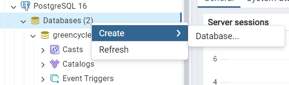
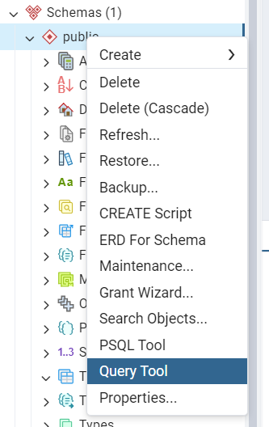
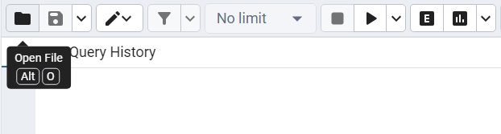
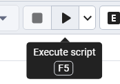
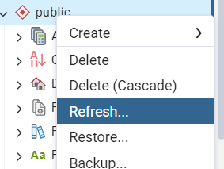
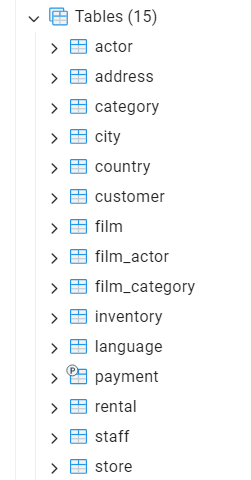
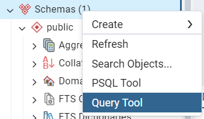
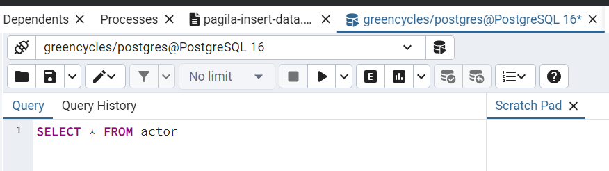
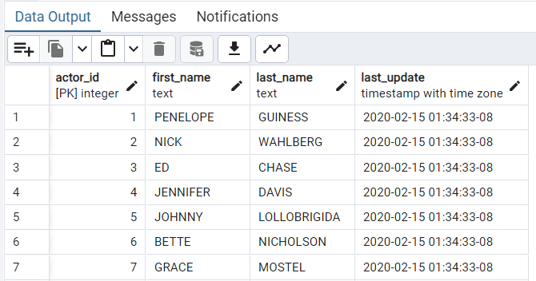
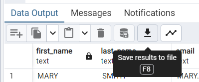

## Section 01: Day 1 - Getting Started with SQL

#### Table of Contents

- How to get the most out of the course
- How this course works
- Why learning SQL?
- Let the Joruney Begin!
- Coding Exercise 1: Let's get started!
- What is a database?
- Quiz 1: Databases
- Different dialects of SQL
- Quiz 2: Dialects of SQL
- Installing PostgreSQL & pgAdmin (Windows)
- Installing PostgreSQL & pgAdmin (MacOS)
- Setting up the database
- Common problems: Set binary paths
- Common problems: Slow performance
- The Project
- SELECT
- Coding Exercise 2: SELECT
- Challenge: SELECT
- Solution: SELECT
- ORDER BY
- Coding Exercise 3: SELECT & ORDER BY
- Challenge: ORDER BY
- Solution: ORDER BY
- SELECT DISTINCT
- Challenge: SELECT DISTINCT
- Solution: SELECT DISTINCT
- LIMIT
- Coding Exercise 4: SELECT DISTINCT & LIMIT
- COUNT()
- Coding Exercise 5: COUNT()
- Today's challenges
- Today's summary

### How to get the most out of the course

### How this course works

### Why learning SQL?

### Let the Joruney Begin!

### Coding Exercise 1: Let's get started!

### What is a database?

### Quiz 1: Databases

#### Question 1: What is a schema?

Schemas are used to structure databases.

### Different dialects of SQL

#### Why PostgreSQL?

- PostgreSQL is the closest to the Standard SQL
- Most flexible and transition will be easiest
- Free to download and use
- Very popular
- The most advanced DBMS in the world

### Quiz 2: Dialects of SQL

#### Question 1: How can the different dialects of SQL be described?

No database is fully compatible with the SQL standard but they only have minor differences.

#### Question 2: Which is dialect of SQL is considered the closest to the official SQL standard?

PostgreSQL

### Installing PostgreSQL & pgAdmin (Windows)

[PgAdmin Downloads](https://www.enterprisedb.com/downloads/postgres-postgresql-downloads)

### Installing PostgreSQL & pgAdmin (MacOS)

### Setting up the database



Database name: **greencycles**
















```sql
SELECT * FROM actor
```



### Common problems: Set binary paths

### Common problems: Slow performance

PgAdmin is slow

If you experience very slow performance in pgAdmin, you can make one important adjustment.

Make sure pgAdmin is closed.

1. Open the folder C:\Program Files\PostgreSQL\14\data

Replace '14' with your version that you are using if it is not 14.

2. Open the file postgresql.conf by right-clicking it and selecting "Edit" or "Edit with Notepad++".

You can also install Notepad++ if you don't have this option.

3. Press 'CTRL + F' and search for listen_addresses and replace '\*' with '127.0.0.1,::1'

4. Save the file.

5. Open pgAdmin and your performance should be much better now!

### The Project

YOU: Data Analyst

BUSINESS: Online Movie Rental Shop

#### Your job

- Help the company operate
- Gain insights
- Solve problems

#### Your challenges

- Explore meaningful data
- Get insights to make decisions
- Help to operate & navigate

You are responsible for the success!

### SELECT

- Most basic statement SQL
- Used to **select** and return data

```sql
SELECT * FROM address;
```

```sql
SELECT addres, ditrict FROM address;
```

### Coding Exercise 2: SELECT

From the below `books` table only select the columns `title` and `publication_year`.

```sql
SELECT title, publication_year FROM books;
```

### Challenge: SELECT

The Marketing Manager asks you for a **list of all customers**. With **first name**, **last name** and the customer's **email address**. Write a SQL query to get that list!

### Solution: SELECT

```sql
SELECT first_name, last_name, email FROM customer;
```



### ORDER BY

- Used to **order** results based on a column
- Alphabetically, numerically, chronologically etc.

```sql
SELECT first_name, last_name FROM actor ORDER BY first_name ASC;
SELECT * FROM payment ORDER BY customer_id, amount;
SELECT * FROM payment ORDER BY customer_id, amount DESC;
```

### Coding Exercise 3: SELECT & ORDER BY

Given the `books` table, write a SQL query to:

- Select all columns from the `books` table.
- Order the results by the price in descending order.

```sql
SELECT * FROM books ORDER BY price DESC;
```

### Challenge: ORDER BY

You need to help the Marketing team to work more easily. The Marketing Manager asks you to order the customer list by the **last name**. They want to start from "Z" and work towards "A". In case of the same last name the order should be based on the first name -- also from "Z" to "A". Write a SQL query to get that list!

### Solution: ORDER BY

```sql
SELECT
first_name,
last_name,
email
FROM customer ORDER BY last_name DESC, first_name DESC;
```

### SELECT DISTINCT

- Used to **SELECT** the **DISTINCT** values in a table

```sql
SELECT DISTINCT
first_name,
last_name
FROM actor
ORDER BY first_name;
```

```sql
SELECT DISTINCT rating FROM film;
SELECT DISTINCT rental_duration FROM film;
```

### Challenge: SELECT DISTINCT

A marketing team member asks you about the different prices from the `payment` table that have been paid. To make it easier for them order the prices from high to low. Write a SQL query to get the different prices!

### Solution: SELECT DISTINCT

```sql
SELECT DISTINCT amount FROM payment ORDER BY amount DESC;
```

### LIMIT

- Used to **LIMIT** the number of rows in the output
- Always at the very end of your query
- Can help to get a quick idea about a table

```sql
SELECT
first_name
FROM actor
ORDER BY first_name
LIMIT 4;
```

```sql
SELECT * FROM rental
ORDER BY rental_date DESC
LIMIT 10;
```

### Coding Exercise 4: SELECT DISTINCT & LIMIT

Write a single SQL query to retrieve the first 5 _unique_ genres in ascending alphabetical order.

Column: `genre` in the `books` table.

This query will test your ability to filter out duplicates and limit the result set.

Remember, the result should only show distinct genres, meaning if there are multiple books of the same genre, that genre should only appear once in your result set. Also, ensure the genres are listed in alphabetical order and limit the output to the first 5 genres.

```sql
SELECT DISTINCT genre FROM books ORDER BY genre ASC LIMIT 5;
```

### COUNT()

- Used to **COUNT** the number of rows in an output
- Used often in combination with grouping & filtering

```sql
SELECT
COUNT(first_name)
FROM actor
```

```sql
SELECT
COUNT(DISTINCT first_name)
FROM actor
```

### Coding Exercise 5: COUNT()

Given the table `employees`, write a single SQL query to count the total number of employees in the company.

- **Table Name**: `employees`
- **Relevant Columns**: `id` (you can count rows using any column, but id is usually preferred for its uniqueness)

```sql
SELECT COUNT(id) FROM employees;
```

### Today's challenges

1. Create a list of all the **distinct districts** customers are from.
2. What is the **latest rental date**?
3. **How many films** does the company have?
4. **How many distinct names** of the customers are there?

```sql
SELECT DISTINCT district FROM address;
SELECT rental_date FROM rental ORDER BY rental_date DESC LIMIT 1;
SELECT COUNT(DISTINCT title) FROM film;
SELECT COUNT(DISTINCT last_name) FROM customer;
```

### Today's summary

#### What is SQL?

SQL = Structured Query Language

#### Interact with databases

- Retrieve data
- Analyze data
- Define data
- Change data

#### Why learn SQL?

- Data is everywhere and mostly in databases
- Maybe the most important skill as
  - Data analyst
  - Data scientist
  - Business analyst
- Learning SQL is easy & intuitive

#### What is database?

A data space for structured data.

DBMS = Database Management System (i.e., PostgreSQL)

#### PostgreSQL + PgAdmin

#### Project = greencycles
