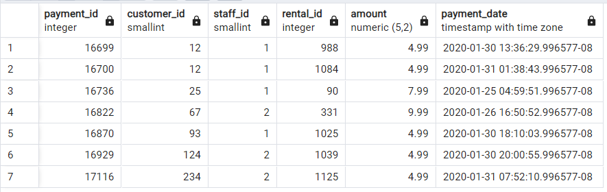
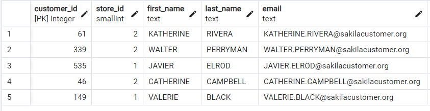

## Section 02: Day 2 - Basics: Filtering

#### Table of Contents

- WHERE
- Coding Exercise 6: WHERE
- Challenge: WHERE
- Solution: WHERE
- WHERE operators
- Coding Exercise 7: WHERE operators
- Challenge: WHERE operators
- Solution: WHERE operators
- WHERE with AND/OR
- Coding Exercise 8: WHERE with AND/OR
- Challenge: WHERE with AND/OR
- Solution: WHERE with AND/OR
- Quick note on time zones
- BETWEEN
- Coding Exercise 9: BETWEEN
- Challenge: BETWEEN
- Solution: BETWEEN
- IN
- Coding Exercise 10: IN operator
- Challenge: IN
- Solution: IN
- LIKE
- Coding Exercise 11: LIKE
- Challenge: LIKE
- Solution: LIKE
- Comments & Aliases
- Today's summary
- Today's challenges

### WHERE

- Used to **filter** the data in the output
- Always after FROM

```sql
SELECT
column_name1,
column_name2,
FROM table_name
WHERE condition
```

```sql
SELECT
*
FROM payment
WHERE amount = 10.99
```

```sql
SELECT
first_name,
last_name
FROM
customer
WHERE
first_name = 'ADMA'
```

### Coding Exercise 6: WHERE

Write a SQL query to find all products in the 'Electronics' category. Select only the `name` of the product and the `price`.

You need to use only the `SELECT`, `WHERE`, and `ORDER BY` clauses to achieve this. Sort the results by price in ascending order.

Table and Column Names:

- Table: products
- Columns: product_id, name, category, price

```sql
SELECT
name,
price
FROM products
WHERE category = 'Electronics'
ORDER BY price ASC;
```

### Challenge: WHERE

How many payment were made by the customer with customer_id = 100? What is the last name of our customer with first name 'ERICA'? Write a SQL query to get the answers.

### Solution: WHERE

How many payment were made by the customer with customer_id = 100? Write a SQL query to get the answers.

```sql
SELECT
COUNT(customer_id)
FROM customer
WHERE customer_id = 100;
```

What is the last name of our customer with first name 'ERICA'? Write a SQL query to get the answers.

```sql
SELECT
first_name,
last_name
FROM customer
WHERE first_name = 'ERICA';
```

### WHERE operators

#### Greater than

```sql
SELECT
*
FROM
payment
WHERE
amount > 10.99
```

#### Less than

```sql
SELECT
*
FROM
payment
WHERE
amount < 10.99
```

```sql
SELECT
*
FROM
payment
WHERE
amount < 10.99
ORDER BY amount DESC
```

```sql
SELECT
*
FROM
payment
WHERE
amount != 10.99
```

```sql
SELECT
first_name,
last_name
FROM
customer
WHERE
first_name is null
```

```sql
SELECT
first_name,
last_name
FROM
customer
WHERE
first_name is not null
```

### Coding Exercise 7: WHERE operators

Write a SQL query to find all products (only select `name` and `price`) that have a price of more than 200.

You need to use only the `SELECT`, `WHERE`, and `ORDER BY` clauses to achieve this. Sort the results by price in ascending order.

Table and Column Names:

- Table: products
- Columns: product_id, name, category, price

```sql
SELECT
name,
price
FROM products
WHERE price > 200
ORDER BY price ASC;
```

### Challenge: WHERE operators

The inventory manager asks you how rentals have not been returned yet (return_date is null). The sales manager asks you how for a list of all the payment_ids with an amount less than or equal to $2. Include payment_id and the amount. Write a SQL query to get the answers!

### Solution: WHERE operators

The inventory manager asks you how rentals have not been returned yet (return_date is null). Write a SQL query to get the answers!

```sql
SELECT
COUNT(rental_id)
FROM rental
WHERE return_date is null;
```

The sales manager asks you how for a list of all the payment_ids with an amount less than or equal to $2. Include payment_id and the amount. Write a SQL query to get the answers!

```sql
SELECT
id,
amount
FROM payment
WHERE amount <= 2;
ORDER BY amount DESC;
```

### WHERE with AND/OR

- Used to **connect** two conditions

```sql
SELECT
column_name1,
column_name2
FROM
table_name
WHERE
condition1
AND
condition2
AND
condition3
```

```sql
SELECT
*
FROM
payment
WHERE
amount = 10.99
AND
customer_id = 426
```

```sql
SELECT
*
FROM
payment
WHERE
amount = 10.99
OR
amount = 9.99
```

```sql
SELECT
*
FROM
payment
WHERE
amount = 10.99 OR 9.99
```

```sql
SELECT
*
FROM
payment
WHERE
amount = 10.99
OR
amount = 9.99
AND
customer_id = 426
```

```sql
SELECT
*
FROM
payment
WHERE
amount = 10.99
OR
amount = 9.99
AND
customer_id = 426
```

```sql
SELECT
*
FROM
payment
WHERE
amount = 10.99
OR
amount = 9.99
AND
customer_id = 426
```

```sql
SELECT
first_name,
last_name
FROM
customer
WHERE
first_name = 'ADAM'
```

### Coding Exercise 8: WHERE with AND/OR

Write a SQL query to find all products in the 'Electronics' category that have a price of more than 200.

You need to use only the `SELECT`, `WHERE`, and `ORDER BY` clauses to achieve this. Sort the results by price in `ascending` order.

Select only product `name` and and `price`.

Necessary Table and Column Names:

- Table: products
- Columns: product_id, name, category, price

```sql
SELECT
name,
price
FROM products
WHERE category = 'Electronics' and price > 200
ORDER BY price ASC;
```

### Challenge: WHERE with AND/OR

The suppcity manager asks you about a list of all the payment of the customer 322, 346 and 354 where the amount is either less than $2 or greater than $10. It should be ordered by the customer first (ascending) and then as second condition order by amount in a descending order.

### Solution: WHERE with AND/OR

```sql
SELECT
*
FROM payment
WHERE
(customer_id = 322 OR customer_id = 346 OR customer_id = 354)
AND
(amount < 2 OR amount > 10)
ORDER BY customer_id ASC, amount DESC;
```

### Quick note on time zones

To avoid the data output looking a bit different in your case you can change the time zone of the database we have set up. To do that just open up the query tool from the greencycles database and run the following code:

```sql
ALTER DATABASE greencycles SET timezone TO 'Europe/Berlin';
```

Afterward, just close the current session by closing the current Query Tool window.

### BETWEEN

- Used to filter a range of values

```sql
SELECT
payment_id,
amount
FROM
payment
WHERE
amount NOT BETWEEN 1.99 AND 6.99
```

```sql
SELECT
payment_id,
amount
FROM
payment
WHERE
amount BETWEEN '2020-01-24' AND '2020-01-26'
```

```sql
SELECT
payment_id,
amount
FROM
payment
WHERE
amount BETWEEN '2020-01-24 0:00' AND '2020-01-26 0:00'
```

```sql
SELECT
payment_id,
amount
FROM
payment
WHERE
amount BETWEEN '2020-01-24 0:00' AND '2020-01-26 12:00'
```

### Coding Exercise 9: BETWEEN

Write a single SQL query to find all transactions from the the table `sales` that occurred between `'2024-01-10'` and `'2024-02-10'`, inclusive. Display the transaction ID, date, and amount. Order the results by the date of the transaction.

Make sure you return:

- id
- date
- amount
  Order by the transaction date.

```sql
SELECT
id,
date,
amount
FROM sales
WHERE date BETWEEN '2024-01-10' AND '2024-02-10';
```

### Challenge: BETWEEN

There have been some faulty payments and you need to help to find out how many payments have been affected between January 26th and January 27th 2020 with an amount between 1.99 and 3.99?

### Solution: BETWEEN

```sql
SELECT
COUNT(*)
FROM payment
WHERE
(amount BETWEEN 1.99 AND 3.99)
AND
(payment_date BETWEEN '2020-01-26' AND '2020-01-28');
```

### IN

```sql
SELECT * FROM customer
WHERE customer_id IN (123, 212, 323, 243, 353, 432);
```

### Coding Exercise 10: IN operator

Write a single SQL query to select all distinct customer IDs who ordered either a 'Laptop', 'Tablet', or 'Smartphone'. Order the result by customer ID in ascending order.

Table Name: `orders`
Important Columns: `customer_id`, `product_name`

```sql
SELECT
DISTINCT customer_id
FROM orders
WHERE product_name IN ('Laptop', 'Tablet', 'Smartphone')
ORDER BY customer_id ASC;
```

### Challenge: IN

There have been 6 complaints of customers about their payments. customer_id: 12, 25, 67, 93, 124, 234. The concerned payments are all the payments of these customers with amounts 4.99, 7.99 and 9.99 in January 2020. Write a SQL query to get a list of the concerned payments! It should be 7 payments!

### Solution: IN

```sql
SELECT
*
FROM payment
WHERE
customer_id IN (12, 25, 67, 93, 124, 234)
AND amount IN (4.99, 7.99, 9.99)
AND (payment_date BETWEEN '2020-01-01 0:00' AND '2020-02-01');
```



### LIKE

- Used to filter by matching against a pattern
- Use wildcards: `_` any single character
- Use wildcards: `%` any sequence of characters

```sql
SELECT
*
FROM
actor
WHERE
first_name LIKE 'A%'
```

Note! It's case-sensitive

```sql
SELECT
first_name
FROM
actor
WHERE
first_name LIKE 'a%'
```

```sql
SELECT
*
FROM
actor
WHERE
first_name LIKE '%A%'
```

```sql
SELECT
*
FROM
actor
WHERE
first_name LIKE '_A%'
```

```sql
SELECT
*
FROM
actor
WHERE
first_name NOT LIKE '%A%'
```

```sql
SELECT * FROM film
WHERE description LIKE '%Drama%'
AND title LIKE 'T%'
```

### Coding Exercise 11: LIKE

Write a SQL query to find all reviews that mention the word "love" (case insensitive) in their review text. Your query should return the `CustomerName`, `ProductID`, and `ReviewText`.

Table Name: `CustomerReviews`
Column Names: `CustomerName`, `ProductID`, `ReviewText`

```sql
SELECT
customerName,
ProductID,
ReviewText
FROM CustomerReviews
WHERE ReviewText LIKE '%love%';
```

### Challenge: LIKE

You need to help the inventory manager to find out: How many movies are there that contain the "Documentary" in the description? Write a SQL query to get the answers!

How many customers are there with a first name that is 3 letters long and either an 'X' or a 'Y' as the last letter in the last name? Write a SQL query to get the answers!

### Solution: LIKE

```sql
SELECT
COUNT(*)
FROM film
WHERE description LIKE '%Documentary%';
```

Result: 101

```sql
SELECT
COUNT(*)
FROM customer
WHERE first_name LIKE '___'
AND (last_name LIKE '%X' OR last_name LIKE '%Y');
```

Result: 3

### Comments & Aliases

- Comment to make code more readable & understandable
- Use `--` single line comment
- Use `/* [...] */` multiple line comment

Note! Use comments to explain your code!

```sql
-- 2020/07/01 by Nikolai
-- Query that filters amount

SELECT
*
FROM
payment
WHERE
amount = 10.99
```

```sql
/* 2020/07/01 by Nikolai
Query to filter by amount */

SELECT
*
FROM
payment
WHERE
amount = 10.99
```

```sql
SELECT
*
FROM
payment
WHERE
amount = 10.99
-- AND customer_id = 426
```

```sql
SELECT
*
FROM
payment
-- WHERE amount = 10.99
-- AND customer_id = 426
```

```sql
SELECT
*
FROM
payment
/* WHERE amount = 10.99
AND customer_id = 426 */
```

```sql
SELECT
payment_id AS invoice_no
FROM payment
```

```sql
SELECT
-- title,
description AS description_of_movie,
release_year
FROM film
WHERE description LIKE '%Documentary%';
```

```sql
SELECT
COUNT(*) AS number_of_movie
FROM film
WHERE description LIKE '%Documentary%';
```

### Today's summary

- WHERE
- AND/OR
- BETWEEN
- IN
- LIKE
- AS
- Comment

### Today's challenges

1. How many movies are there that contain 'Saga' in the description and where the title starts either with 'A' or ends with 'R'? Use the alias 'no_of_movies'.
2. Create a list of all customers where the first name contains 'ER' and has an 'A' as the second Order the results by the last name descendingly.
3. How many payments are there where the amount is either 0 or is between 3.99 and 7.99 and in the same time has happened on 2020 05 01.

#### Solutions

```sql
SELECT
COUNT(*) AS no_of_movies
FROM film
WHERE description LIKE '%Saga%'
AND (title LIKE 'A%' OR title LIKE '%R');
```

Result: 14

```sql
SELECT
*
FROM customer
WHERE (first_name LIKE '%ER%' AND first_name LIKE '_A%')
ORDER BY last_name DESC;
```



```sql
SELECT
COUNT(*)
FROM payment
WHERE (amount = 0 OR amount BETWEEN 3.99 AND 7.99)
AND payment_date BETWEEN '2020-05-01' AND '2020-05-02';
```
